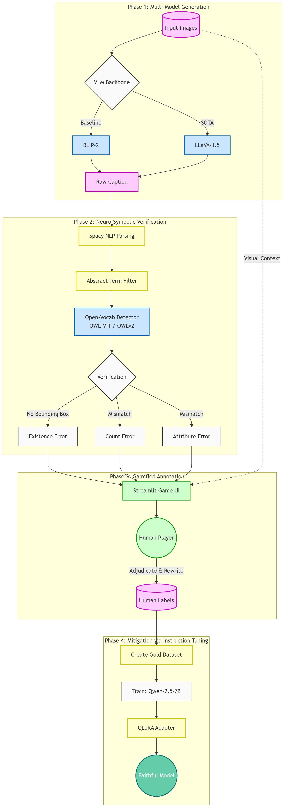
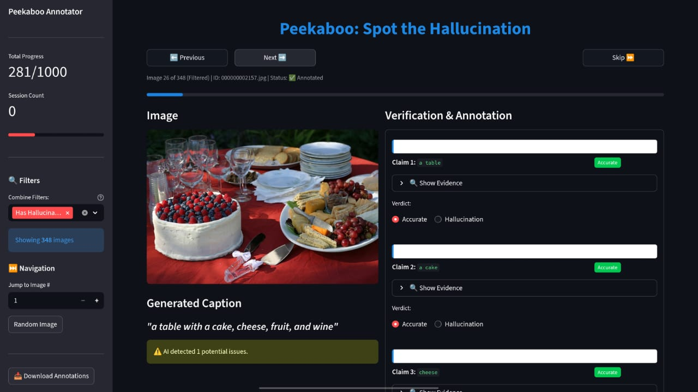
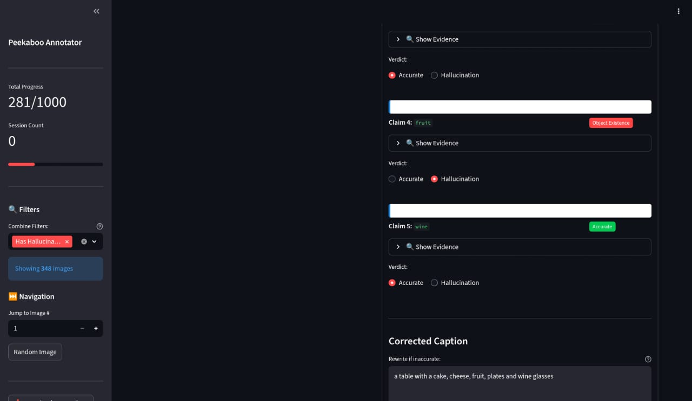
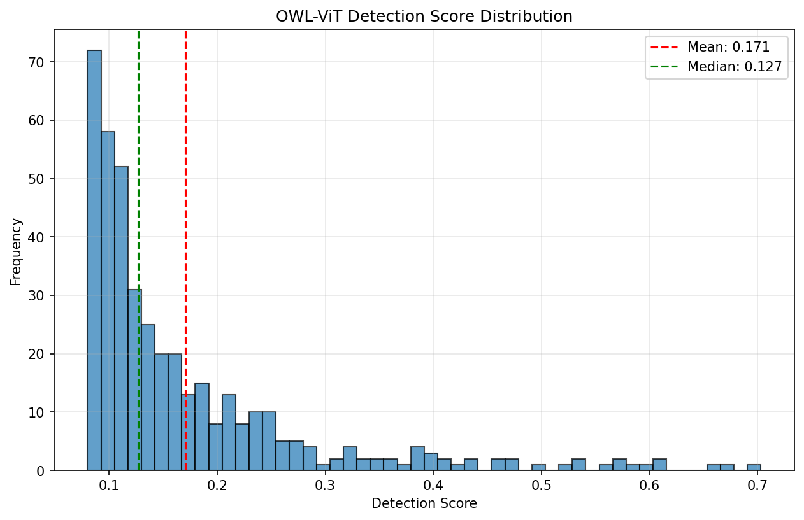
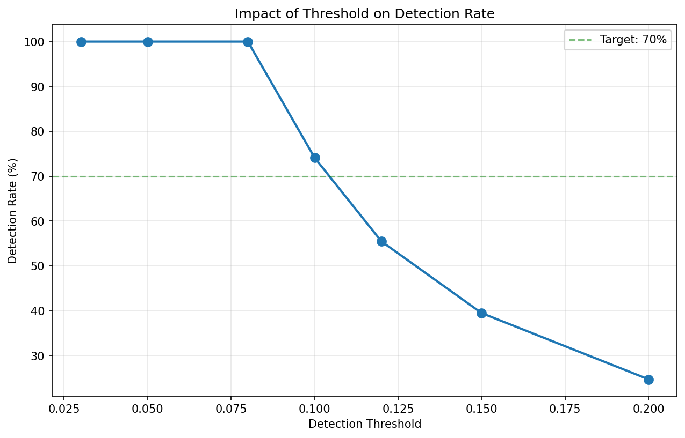
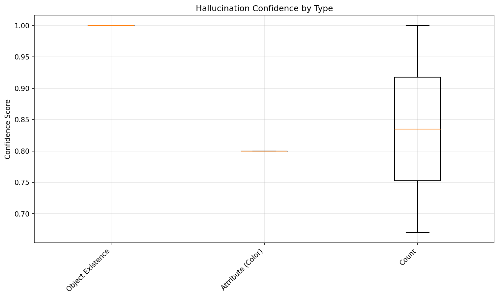

# Peekaboo: Spot the Hallucination Caption Game
[](https://www.python.org/downloads/)
[](https://pytorch.org/)
[](https://huggingface.co/)
[](https://streamlit.io/)
[](https://opensource.org/licenses/MIT)

**A Gamified Protocol for Measuring and Mitigating Hallucinations in Vision-Language Models**

---

## Abstract

Large Vision-Language Models (LVLMs) like LLaVA and BLIP-2 demonstrate remarkable multimodal understanding, yet they are critically bottlenecked by **hallucinations** — confidently fabricating objects, misattributing colors, or miscounting instances.

**Peekaboo** is a closed-loop, hybrid neuro-symbolic framework designed to tackle this. By chaining Open-Vocabulary Object Detection (OWLv2) with linguistic parsing (spaCy), Peekaboo automatically fact-checks AI-generated captions. It features a gamified Human-in-the-Loop (HITL) interface to curate high-quality Gold Datasets, which are then used to fine-tune **Qwen-2.5-7B via QLoRA** to autonomously rewrite and ground hallucinated captions.

---

## Key Features

- **Hybrid Verification:** Combines VLM caption generation with explicit symbolic grounding via OWLv2 bounding box detection and RGB pixel heuristics
- **Abstract Term Filtering:** Custom NLP logic filters undetectable generic concepts (e.g. "scene", "background") to drastically reduce false positive errors
- **Gamified HITL Interface:** Streamlit dashboard for rapid human adjudication — anchoring bias is eliminated by withholding bounding boxes from the human reviewer
- **Automated Mitigation:** End-to-end QLoRA pipeline that teaches a base LLM to detect and rewrite hallucinated claims in visual captions

---

## System Architecture



The pipeline runs in 4 sequential phases:

**Phase 1 — Caption Generation:** BLIP-2 (baseline) or LLaVA-1.5 (SOTA) generates a raw caption for each image from the COCO 2017 validation set.

**Phase 2 — Neuro-Symbolic Verification:** spaCy parses the caption into noun chunks. An abstract term filter removes undetectable concepts. OWLv2 then queries the image for each remaining claim and flags three error types:
- **Existence Error** — no bounding box found for a claimed object
- **Count Error** — detected count differs from the stated count beyond tolerance
- **Attribute Error** — detected dominant color mismatches the stated color

**Phase 3 — Gamified Annotation:** A Streamlit UI presents the image and AI verdicts side by side. Human annotators adjudicate each claim and optionally rewrite the caption. This produces the human-verified Gold Dataset.

**Phase 4 — Mitigation via Instruction Tuning:** The Gold Dataset is formatted as instruction pairs and used to fine-tune Qwen-2.5-7B with QLoRA, producing an adapter that corrects hallucinations in new captions.

---

## Gamified Annotation UI

To curate the Gold Dataset, we built a Streamlit application that presents
the AI's claims alongside the original image for human adjudication.

<p align="center">
  
  
</p>
<p align="center">
<em>Left: The full annotation view showing the generated caption and per-claim 
AI verdicts. Right: Claim-level detail — "fruit" flagged as an Object Existence 
hallucination with the corrected caption already rewritten by the annotator.</em>
</p>

---

## Project Structure

```
peekaboo/
├── pipelines/
│   ├── improved_pipeline_owlovd.py   # BLIP-2 + OWLv2 (recommended)
│   ├── improved_pipeline_core.py     # BLIP-2 + OWL-ViT (baseline)
│   ├── llava_owlv2_pipeline.py       # LLaVA + OWLv2
│   └── llava_pipeline_core.py        # LLaVA + OWL-ViT
├── annotation/
│   └── game_ui.py                    # Streamlit annotation tool
├── training/
│   ├── create_gold_dataset.py        # Build fine-tuning dataset
│   ├── train_qwen.py                 # QLoRA fine-tuning
│   └── train_qwen_soft.py            # Conservative fine-tuning
├── evaluation/
│   ├── validate_model.py             # Universal validator
│   ├── validate_human_agreed.py      # Ground truth validator
│   ├── improved_validation_qwen.py   # Qwen-specific validator
│   ├── comprehensive_metrics.py      # Full metrics report
│   └── improved_calc_metrics.py      # Threshold analysis
├── assets/
│   ├── peekaboo_architecture.png
│   ├── confidence_boxplot.png
│   ├── detection_histogram.png
│   ├── threshold_plot.png
│   ├── cke.jpg
│   └── cke_2.jpg
├── data/
│   ├── images/                       # Place images here (not tracked)
│   └── output/                       # Generated outputs (not tracked)
├── .gitignore
├── requirements.txt
└── README.md
```

---

## Setup

### Requirements

- Python 3.10+
- CUDA 12.1 (tested on NVIDIA A30 24GB)
- 24GB+ VRAM recommended for LLaVA + QLoRA training

### Installation

```bash
# 1. Clone the repo
git clone https://github.com/yourusername/peekaboo.git
cd peekaboo

# 2. Install PyTorch with CUDA 12.1
pip install torch==2.1.0+cu121 torchvision==0.16.0+cu121 --index-url https://download.pytorch.org/whl/cu121

# 3. Install remaining dependencies
pip install -r requirements.txt

# 4. Download spaCy model
python -m spacy download en_core_web_sm

# 5. Create data directories
mkdir data\images
mkdir data\output
```

### Data

**Dataset:** Download the [COCO 2017 Validation Set](https://cocodataset.org/) and place the images inside `data/images/`.  
Or you can place your own custom images in `data/images/`. The pipeline expects `.jpg`, `.jpeg`, or `.png` files.

---

## Usage

### Phase 1 + 2: Run Detection Pipeline

```bash
# Option A: BLIP-2 + OWLv2 (recommended)
python pipelines/improved_pipeline_owlovd.py --image_dir data/images --limit 500

# Option B: LLaVA + OWLv2 (better captions, more VRAM)
python pipelines/llava_owlv2_pipeline.py --image_dir data/images --limit 500

# Option C: BLIP-2 + OWL-ViT (baseline)
python pipelines/improved_pipeline_core.py --image_dir data/images --limit 500
```

Output saved to `data/output/results.json`.

Key arguments:
| Argument | Default | Description |
|---|---|---|
| `--limit` | 500 | Number of images to process |
| `--confidence_threshold` | 0.15 | OWLv2 detection threshold |
| `--count_tolerance` | 1 | Allowed count mismatch before flagging |

### Phase 3: Human Annotation

```bash
streamlit run annotation/game_ui.py
```

Opens in browser at `http://localhost:8501`. Annotators verify AI predictions claim-by-claim and optionally rewrite the caption.

Output saved to `data/output/human_annotations.json`.

### Phase 4a: Create Gold Dataset

```bash
python training/create_gold_dataset.py --strategy replace
```

Strategies: `remove` (delete hallucinated phrase), `replace` (substitute with generic term), `rephrase` (restructure sentence).  
Output saved to `data/output/human_gold_dataset.json`.

### Phase 4b: Fine-tune Qwen2.5-7B

```bash
# Standard training
python training/train_qwen.py

# Conservative training for small datasets (<200 samples)
python training/train_qwen_soft.py
```

Adapter saved to `checkpoints_qwen_*/final_adapter/`.

### Validation

```bash
# Quick validation: Validate against AI-detected hallucinations
python evaluation/validate_model.py --adapter_path checkpoints_qwen_soft/final_adapter

# Validate against human ground truth
python evaluation/validate_human_agreed.py --adapter_path checkpoints_qwen_soft/final_adapter

# Full metrics report
python evaluation/comprehensive_metrics.py
```

---

## Results

<p align="center">
  
  
  
</p>

Rather than using arbitrary thresholds, we empirically calibrated OWLv2 for unconstrained visual vocabularies:

- **Detection Score Distribution (left):** Right-skewed scores confirm that standard detection thresholds (e.g. 0.5) fail for open-vocabulary VLM captions. Median score is 0.127.
- **Threshold Impact (center):** The optimal threshold range of 0.12–0.15 maintains >70% detection recall without excessive false positives.
- **Confidence by Type (right):** Existence errors are detected with near-perfect confidence (1.0). Count errors show higher variance (0.67–1.0). Color errors are assigned a fixed calibrated score of 0.8.


---

## Models Used

| Component | Model | Size |
|-----------|-------|------|
| Captioner (baseline) | Salesforce/blip2-opt-2.7b | 2.7B |
| Captioner (SOTA) | llava-hf/llava-1.5-7b-hf | 7B |
| Detector | google/owlv2-base-patch16-ensemble | 307M |
| Corrector | Qwen/Qwen2.5-7B-Instruct + QLoRA | 7B |